# Design Document

Authors: Roberto Alessi (290180), Michelangelo Bartolomucci (292422), Gianvito Marzo (281761), Roberto Torta (290184)

Date: 30/04/2021

Version: 1.0


# Contents

- [High level design](#package-diagram)
- [Low level design](#class-diagram)
- [Verification traceability matrix](#verification-traceability-matrix)
- [Verification sequence diagrams](#verification-sequence-diagrams)

# Instructions

The design must satisfy the Official Requirements document, notably functional and non functional requirements

# High level design

The model used is MVC (Model-View-Controller) since is a standalone application working on a single cash register. The façade class is Shop.

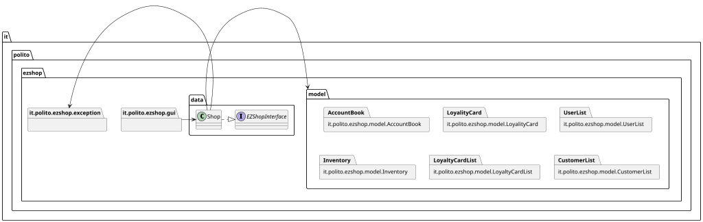

# Low level design

```plantuml
@startuml
top to bottom direction
scale 1024 width 
scale 768 height

note as Persistent
  Persistent classes: 
  UserList, Inventory, 
  CustomerList, AccountBook, 
  OrderList, LoyaltyCardList.
end note

package it.polito.ezshop.model{

    class User{
        - id : Integer
        - username : String
        - password : String
        - role : enum{"Administrator"|"Cashier"|"ShopManager"}
        - status : Boolean
    }

    class UserList <<Persistent>> {
        - List : ArrayList<User>
        
        + createUser()
        + deleteUser()
        + getAllUsers()
        + getUser()
        + updateUserRights()
        + login()
        + logout()
        - savePersistent()
    }

    class ProductType{
        - id : Integer
        - productCode : String
        - description : String
        - pricePerUnit : double
        - quantity : Integer
        - discountRate : Integer
        - notes : String
        - position : ArrayList<Position>
    }

    class Inventory <<Persistent>> {
        - list : ArrayList<ProductType>
        
        + createProductType()
        + updateProduct()
        + deleteProductType()
        + getAllProductTypes()
        + getProductTypeByBarCode()
        + getProductTypesByDescription()
        + updateQuantity()
        + updatePosition()
        + removePosition()
        - savePersistent()
    }

    class Order{
        - orderId : Integer
        - productId : Integer
        - supplier: String
        - pricePerUnit : double
        - quantity: int
        - status: enum{ISSUED|ORDERED|COMPLETED}
    }

    class OrderList  <<Persistent>> {    
        - orderList : ArrayList<Order>

        + issueOrder()
        + payOrderFor()
        + payOrder()
        + getAllOrders()
        + recordOrderArrival()
        - savePersistent()
        
    }

    class Position{
        + aisleID : Integer
        + rackID : Integer
        + levelID : Integer
    }

    class Quantity{
        - quantity : HashMap<Integer,Integer>
    }

    class LoyaltyCard{
        - cardId : String
        - points : Integer
        - customerId : String
    }

    class LoyaltyCardList  <<Persistent>> {
        - LoyaltyCardList: ArrayList<LoyaltyCard>

        + createCard()
        + modifyPointsOnCard()
        - savePersistant()
    }

    class Customer{
        - customerId : Integer
        - loyaltyCardId : ArrayList<String>
        - name : String
        - surname : String
    }

    class CustomerList <<Persistent>> {
        - customersList : ArrayList<Customer>

        + defineCustomer()
        + deleteCustomer()
        + searchCustomer()
        + modifyCustomer()
        + getCustomer()
        + getAllCustomers()
        + attachCardToCustomer()
        - savePersistent()
    }

    class BalanceOperation {
        - description : String
        - amount : Double
        - date : Date
        - type : enum{DEBIT|CREDIT}
    }


    class SaleTransaction{
        - transactionElements : Map<ProductType,Integer>
        - id : Integer
        - points : Integer
        - date : Date
        - time : DateTime
        - cost : Double
        - paymentType : String
        - discountRate : Integer
        - returnedProducts : ArrayList<ReturnTransaction>
    }

    class ReturnTransaction {
        - quantity : Integer 
        - returnedValue : ProductType
        - idSaleTransaction : Integer
    }

    class AccountBook <<Persistent>> {
        - listTransaction : List<BalanceOperation>

        + startReturnTransaction()
        + returnProduct()
        + endReturnTransaction()
        + deleteReturnTransaction()
        + startSaleTransaction()
        + deleteSaleTransaction()
        + endSaleTransaction()
        + getSaleTransaction()
        + receivePaymentCash()
        + receivePaymentcreditCard()
        + returnPaymentCash()
        + returnPaymentCreditCard()
        + recordBalanceUpdate()
        + getCreditsAndDebits()
        + computeBalance()
        + computePointsForSale()
        + addProductToSale()
        + deleteProductFromSale()
        + applyDiscountRateToProduct()
        + applyDiscountRateToSale()
        - savePersistent()
    }
}

package it.polito.ezshop.data{
    class Shop{
        + reset()
        + createUser()
        + deleteUser()
        + getAllUsers()
        + getUser()
        + updateUserRights()
        + login()
        + logout()
        + createProductType()
        + updateProduct()
        + deleteProductType()
        + getAllProductTypes()
        + getProductTypeByBarCode()
        + getProductTypesByDescription()
        + updateQuantity()
        + updatePosition()
        + removePosition()
        + issueOrder()
        + payOrderFor()
        + payOrder()
        + recordOrderArrival()
        + getAllOrders()
        + defineCustomer()
        + modifyCustomer()
        + deleteCustomer()
        + getCustomer()
        + getAllCustomers()
        + createCard()
        + attachCardToCustomer()
        + modifyPointsOnCard()
        + startSaleTransaction()
        + addProductToSale()
        + deleteProductFromSale()
        + applyDiscountRateToProduct()
        + applyDiscountRateToSale()
        + computePointsForSale()
        + deleteSaleTransaction()
        + endSaleTransaction()
        + getSaleTransaction()
        + startReturnTransaction()
        + returnProduct()
        + endReturnTransaction()
        + deleteReturnTransaction()
        + receiveCashPayment()
        + receiveCreditCardPayment()
        + returnCashPayment()
        + returnCreditCardPayment()
        + recordBalanceUpdate()
        + getCreditsAndDebits()
        + computeBalance()
    }
}

note as ShopConnections
    Shop class is connected with UserList, Inventory, OrderList, 
    LoyaltyCardList, CustomerList and AccountBook
end note


SaleTransaction "*" -- "*" ProductType
BalanceOperation <-- Order
LoyaltyCardList "1" --> "*" LoyaltyCard
Inventory "1" --> "*" ProductType
Position "*"-- "1"ProductType
User "*" <- "1" UserList
LoyaltyCard "*" -- " 1" Customer
Customer "*" <-- "1" CustomerList
Order "*" --> ProductType
OrderList "1" --> "*" Order
BalanceOperation"1" --> "*"AccountBook
ReturnTransaction --|> BalanceOperation
SaleTransaction -left-|> BalanceOperation
Shop -up-> it.polito.ezshop.model
Shop .. ShopConnections
(SaleTransaction, ProductType)  .left. Quantity
it.polito.ezshop.model -- Persistent


@enduml
```

# Verification traceability matrix

|FR |Customer|CustomerList|LoyaltyCard|LoyaltyCardList|Inventory|ProductType|Position |SaleTransaction|ReturnTransaction|AccountBook|Exception|Quantity|Order|User|UserList|Shop|
|:-:|:------:|:----------:|:---------:|:-------------:|:-------:|:---------:|:-------:|:-------------:|:---------------:|:---------:|:-------:|:------:|:---:|:--:|:------:|:--:|
|FR1|        |            |           |               |         |           |         |               |                 |           |        x|        |     |   x|       x|   x| 
|FR3|        |            |           |               |        x|          x|         |               |                 |           |        x|        |    x|    |        |   x| 
|FR4|        |            |           |               |        x|          x|        x|              x|                x|          x|        x|        |    x|    |        |   x| 
|FR5|       x|           x|          x|              x|         |           |         |              x|                x|           |        x|        |     |    |        |   x| 
|FR6|       x|           x|          x|              x|        x|          x|         |              x|                x|          x|        x|       x|     |    |        |   x| 
|FR7|       x|           x|          x|              x|         |           |         |              x|                x|          x|        x|       x|     |    |        |   x| 
|FR8|        |            |           |               |         |           |         |              x|                x|          x|        x|        |     |    |        |   x|


# Verification sequence diagrams 

## Use Case 1

### Scenario 1-1

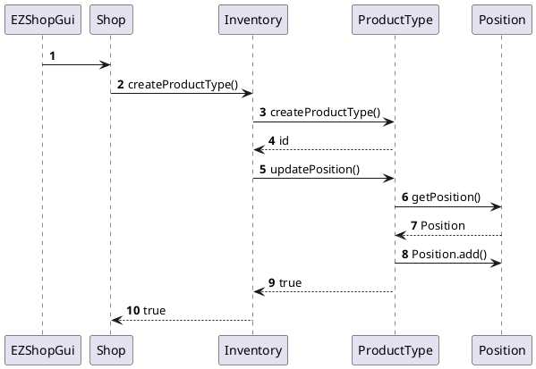

### Scenario 1-3

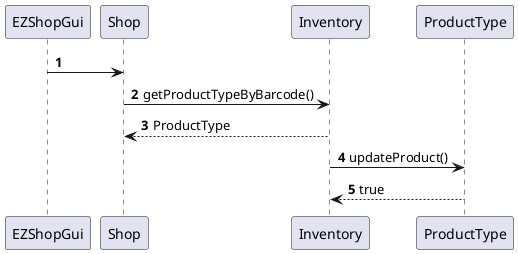

## Use Case 2

### Scenario 2-1

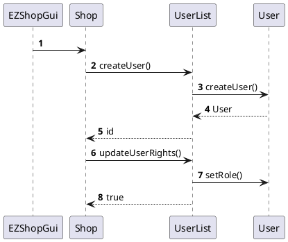

### Scenario 2-2

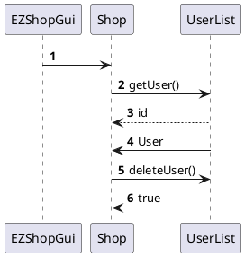

## Use Case 3

### Scenario 3-1

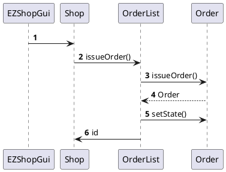

### Scenario 3-2

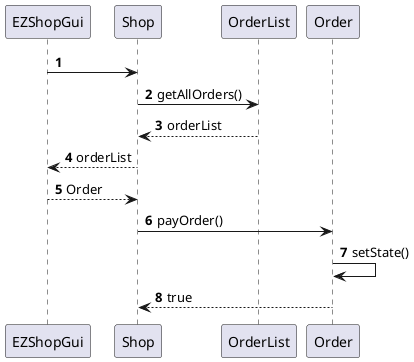

### Scenario 3-3

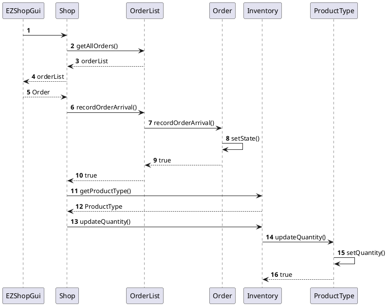

## Use Case 4

### Scenario 4-1 

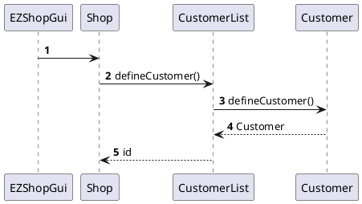

### Scenario 4-2

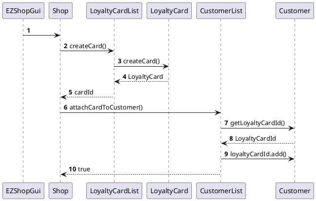

### Scenario 4-4

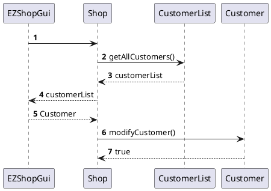

## Use Cases 5

### Scenario 5-1

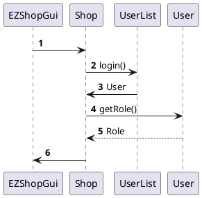

### Scenario 5-2

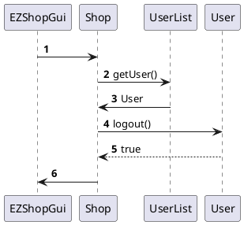

## Use Cases 6

### Scenario 6-1


### Scenario 6-2

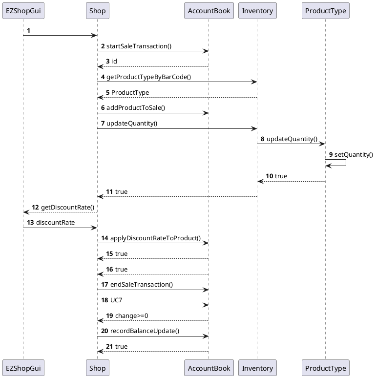

### Scenario 6-4

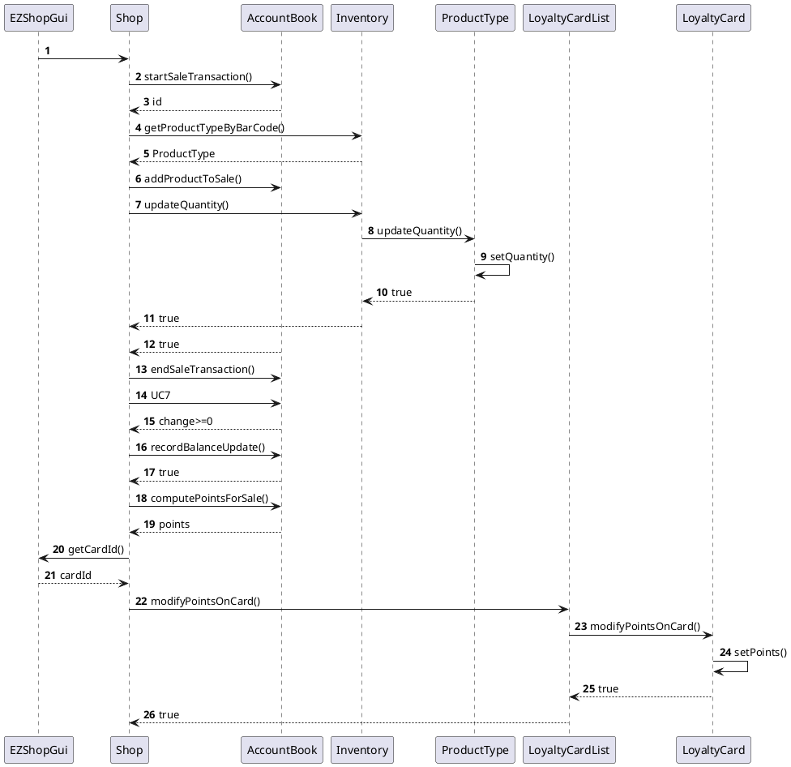

### Scenario 6-5

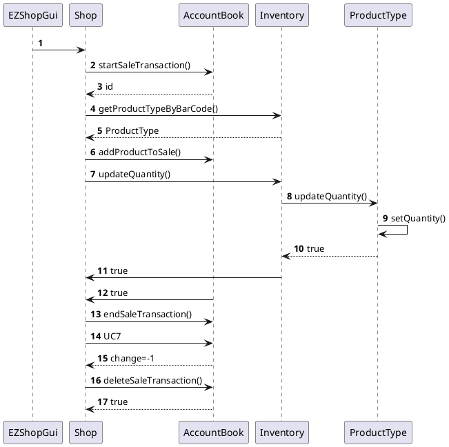

## Use Case 7

### Scenario 7-4

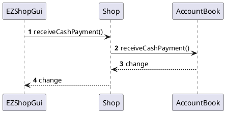

## Use Case 8

### Scenario 8-1

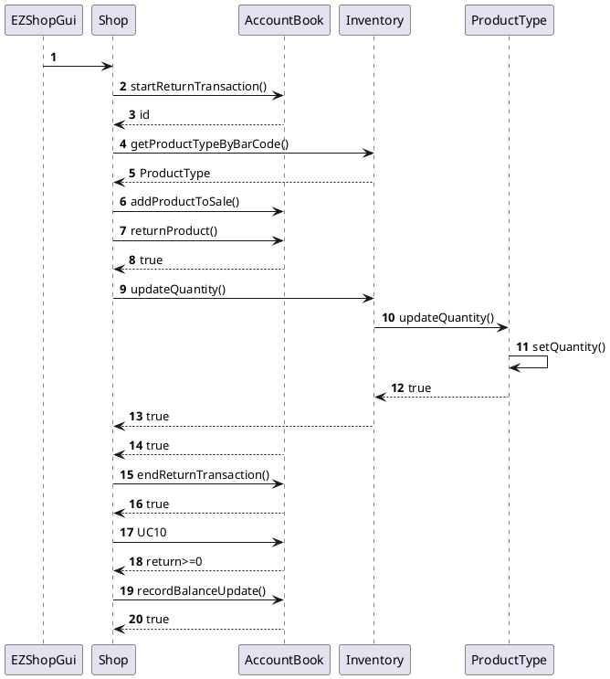

## Use Case 9

### Scenario 9-1

```plantuml
@startuml
autonumber
EZShopGui -> Shop
EZShopGui <- Shop : getFromDate()
EZShopGui --> Shop : fromDate
EZShopGui <- Shop : getToDate()
EZShopGui --> Shop : toDate
Shop -> Accounting :getCreditsAndDebits()
Shop <-- Accounting :balanceOperations
EZShopGui <-- Shop  : balanceOperations
@enduml
```

## Use Case 10

### Scenario 10-2

```plantuml
@startuml
autonumber
EZShopGui -> Shop : returnCashPayment()
Shop -> AccountBook : returnCashPayment()
Shop <-- AccountBook : return
Shop --> EZShopGui : return
@enduml
```
