# Design Document

Authors: Roberto Alessi (290180), Michelangelo Bartolomucci (292422), Gianvito Marzo (281761), Roberto Torta (290184)

Date: 28/04/2021

Version: 0.5


# Contents

- [High level design](#package-diagram)
- [Low level design](#class-diagram)
- [Verification traceability matrix](#verification-traceability-matrix)
- [Verification sequence diagrams](#verification-sequence-diagrams)

# Instructions

The design must satisfy the Official Requirements document, notably functional and non functional requirements

# High level design
<discuss architectural styles used, if any>
The model used is MVC (Model-View-Controller) since is a standalone application working on each cash register separately. The façade class is Shop.

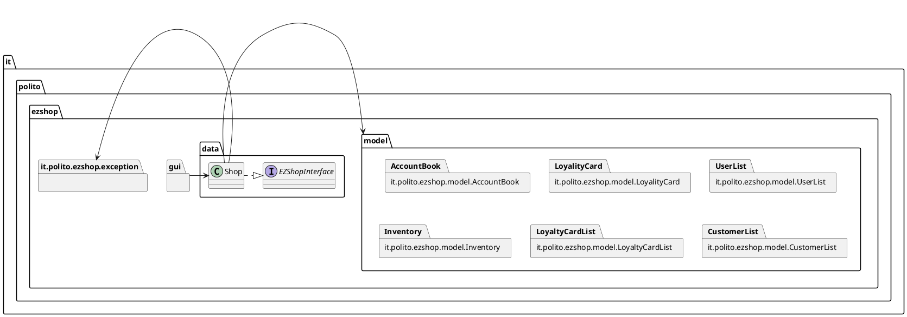

# Low level design

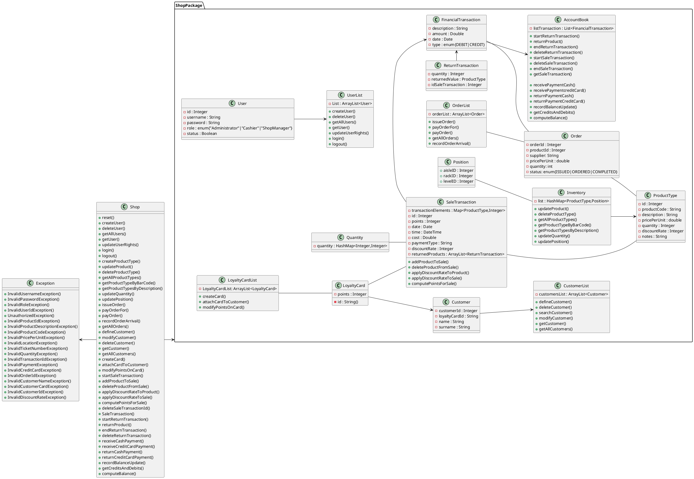


# Verification traceability matrix

\<for each functional requirement from the requirement document, list which classes concur to implement it>

|FR |Customer|CustomerList|LoyaltyCard|LoyaltyCardList|Inventory|ProductType|Position |SaleTransaction|ReturnTransaction|AccountBook|Exception|Quantity|Order|User|UserList|Shop|
|:-:|:------:|:----------:|:---------:|:-------------:|:-------:|:---------:|:-------:|:-------------:|:---------------:|:---------:|:-------:|:------:|:---:|:--:|:------:|:--:|
|FR1|        |            |           |               |         |           |         |               |                 |           |        x|        |     |   x|       x|   x| 
|FR3|        |            |           |               |        x|          x|         |               |                 |           |        x|        |    x|    |        |   x| 
|FR4|        |            |           |               |        x|          x|        x|              x|                x|          x|        x|        |    x|    |        |   x| 
|FR5|       x|           x|          x|              x|         |           |         |              x|                x|           |        x|        |     |    |        |   x| 
|FR6|       x|           x|          x|              x|        x|          x|         |              x|                x|          x|        x|       x|     |    |        |   x| 
|FR7|       x|           x|          x|              x|         |           |         |              x|                x|          x|        x|       x|     |    |        |   x| 
|FR8|        |            |           |               |         |           |         |              x|                x|          x|        x|        |     |    |        |   x|


# Verification sequence diagrams 
\<select key scenarios from the requirement document. For each of them define a sequence diagram showing that the scenario can be implemented by the classes and methods in the design>

## Use Case 1
### Scenario 1-1
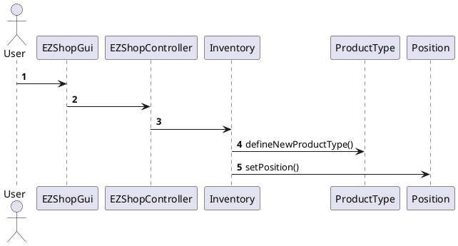

## Use Case 2
### Scenario 2-1
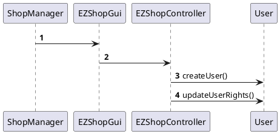

## Use Case 3
### Scenario 3-1
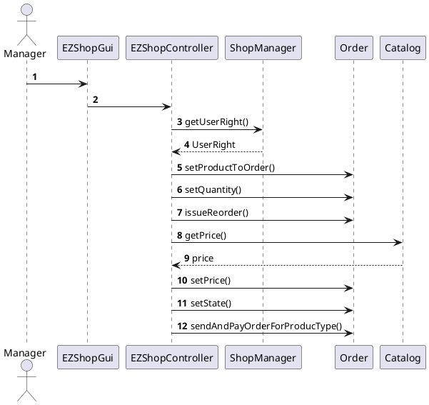

## Use Case 4
### Scenario 4-1
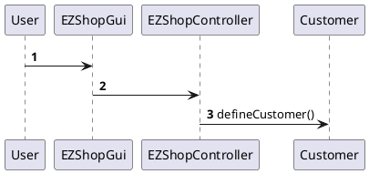

## Use Cases 5
### Scenario 5-1
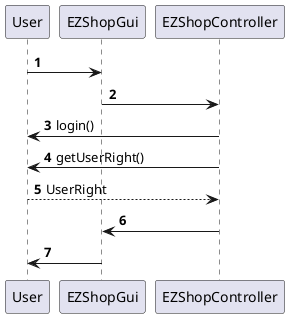

## Use Cases 6
### Scenario 6-1
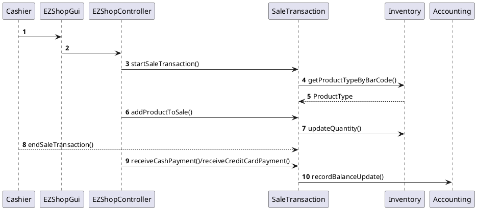


## Use Cases 7
### Scenario 7-1
```plantuml
@startuml

@enduml
```

## Use Case 8
### Scenario 8-1
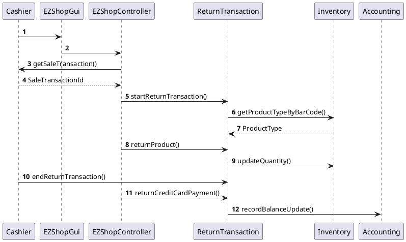

## Use Case 9
### Scenario 9-1
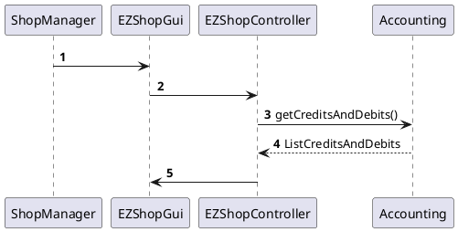
## Use Case 10
### Scenario 10-1
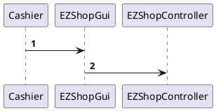


