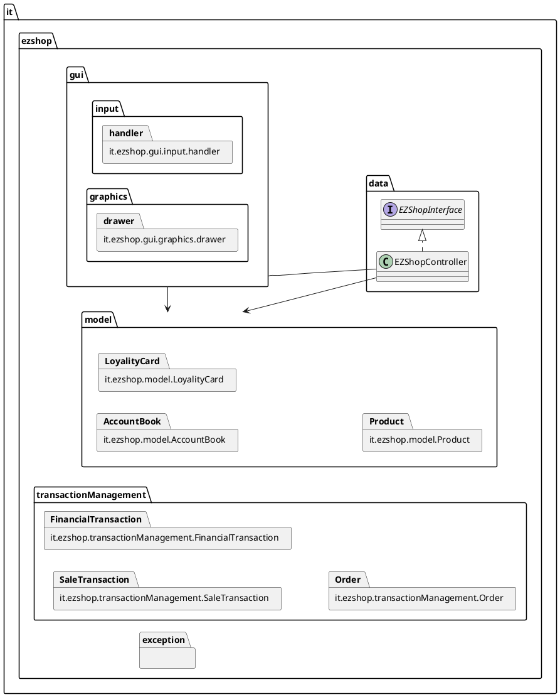
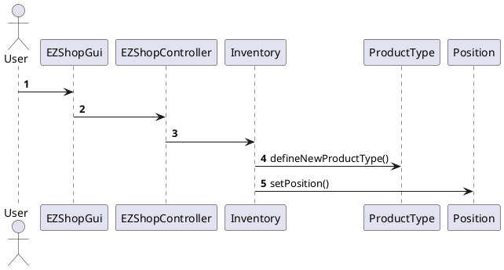
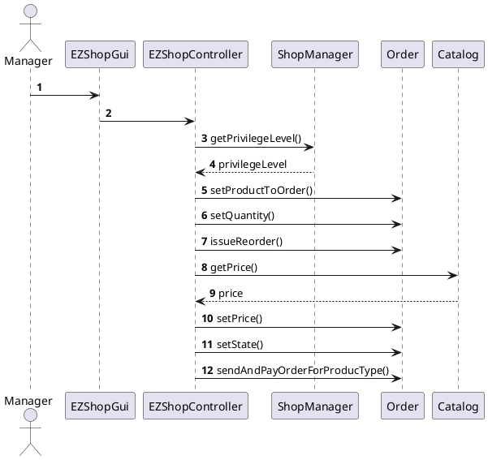

# Design Document

Authors: Roberto Alessi (290180), Michelangelo Bartolomucci (292422), Gianvito Marzo (281761), Roberto Torta (290184)

Date: 26/04/2021

Version: 0.3


# Contents

- [High level design](#package-diagram)
- [Low level design](#class-diagram)
- [Verification traceability matrix](#verification-traceability-matrix)
- [Verification sequence diagrams](#verification-sequence-diagrams)

# Instructions

The design must satisfy the Official Requirements document, notably functional and non functional requirements

# High level design
<discuss architectural styles used, if any>
The model used is MVC since is a standalone application working on each cash register separately.
MODEL: it.ezshop.model.*
VIEW: it.ezshop.gui.*
CONTROLLER : it.ezshop.data.* (EZSHOPInterface implementation inside data)

<report package diagram>



# Low level design

```plantuml
@startuml
left to right direction

class ProductType{
    + barCode : Integer
    + description : String
    + sellPrice : Double
    + quantity : 
    + discountRate : Integer
    + notes : String

    + getProductDescription()
    + setProductDescription()
    + getProductBarCode()
    + setProductBarCode()
    + getSellPrice()
    + setSellPrice()
    + getQuantity()
    + setQuantity()
    + getDiscountRate()
    + getNotes()
    + setNotes()
}

class Catalog{
    + productList : ArrayList<Product>

    + getProductList()
    + manageProductCatalog()
    + searchProductType()
}

class Inventory{
    - productQuantity : HashMap<Product,Integer>
    - productPosition : HashMap<Product,Position>

    + getProductMapQuantity()
    + getProductMapPosition()
    + modifyQuantityForProductType()
    + modifyPositionForProductType()
    + issueReorderWarningForProductType()
    + payIssuedReorderWarning()
    + recordOrderArrival()
    + getListOrdersByStatus()
    + getListProductsTypes()
    + defineNewProductType()
    + modifyExistingProductType()
    + deleteProductType()
    + searchProductType()
}

class Order{
    - price : Double
    - productToOrder : ArrayList<ProductType>
    - state : String
    - quantity : Integer

    + sendAndPayOrderForProducType()
    + getProductToOrder()
    + getQuantity()
    + setQuantity()
    + getState()
    + setState()
    + getPrice()
    + setPrice()
    + setProductToOrder()
}

class Position{
    + aisleID : Integer
    + rackID : Integer
    + levelID : Integer

    + getPosition()
    + setPosition()
}

class LoyaltyCard{
    + points : Integer
    + id : Integer

    + getPoints()
    + getId()
    + createCard()
    + attachCardToCustomer()
    + addPoints()
}

class Customer{
    + loyaltyCardId : Integer
    + name : String
    + surname : String

    + getLoyaltyCard()
    + getName()
    + getSurname()
    + modifyCustomer()
}

class CustomerList{
    + customersList : ArrayList<Customer>

    + defineCustomer()
    + deleteCustomer()
    + searchCustomer()
    + getCustomersList()
}

class FinancialTransaction {
    + description : String
    + amount : Double
    + date : Date
}

class Credit {
}

class Debit {
}

class Quantity {
    + quantity : Integer
}

class SaleTransaction{
    + transactionElements : Map<ProductType,Integer>
    + id : Integer
    + points : Integer
    + date : Date
    + time : DateTime
    + cost : Double
    + paymentType : String
    + discountRate : Integer

    + getTransactionId()
    + addPoints()
    + startSale()
    + addProductToSale()
    + deleteProductFromSale()
    + applyDiscountRateToSale()
    + applyDiscountRateToProductType()
    + computePointsForSale()
    + readBarCodeProduct()
    + printSaleTicket()
    + getSaleTicketFromTicketNumber()
    + closeSaleTransaction()
    + rollbackSaleTransaction()
    + commitSaleTransaction()
    + startReturnTransaction()
    + returnProductListedInSaleTicket()
    + closeReturnTransaction()
    + rollbackReturnTransaction()
    + commitReturnTransaction()
}

class ManagePayment{
    + receivePaymentCash()
    + receivePaymentcreditCard()
    + returnPaymentCash()
    + returnPaymentCreditCard()
}

class AccountBook{
    + listTransaction : List<FinancialTransaction>

    + recordDebit()
    + recordCredit()
    + showMovimentsOverTimePeriod()
    + computeBalance()
}

class Administrator{
    + privilegeLevel : Integer

    + getLevelPrivileges()
}

class ShopManager{
    + privilegeLevel : Integer

    + getLevelPrivileges()
}

class Cashier{
    + privilegeLevel : Integer

    + getLevelPrivileges()
}

class User{
    - username : String
    - password : String
    - status : Boolean

    + getUsername()
    + getStatus()
    + setUsername()
    + setStatus()
    ~ setPassword()
}

class UserList{
    - List : ArrayList<User>

    + addUser()
    + removeUser()
    + listAll()
    + searchUser()
    + changeUserRights()
}

interface EZShopInterface{
    + reset()
    + createUser()
    + deleteUser()
    + getAllUsers()
    + getUser()
    + updateUserRights()
    + login()
    + logout()
    + createProductType()
    + updateProduct()
    + deleteProductType()
    + getAllProductTypes()
    + getProductTypeByBarCode()
    + getProductTypesByDescription()
    + updateQuantity()
    + updatePosition()
    + issueReorder()
    + payOrderFor()
    + payOrder()
    + recordOrderArrival()
    + getAllOrders()
    + defineCustomer()
    + modifyCustomer()
    + deleteCustomer()
    + getCustomer()
    + getAllCustomers()
    + createCard()
    + attachCardToCustomer()
    + modifyPointsOnCard()
    + startSaleTransaction()
    + addProductToSale()
    + deleteProductFromSale()
    + applyDiscountRateToProduct()
    + applyDiscountRateToSale()
    + computePointsForSale()
    + deleteSaleTicket()
    + getSaleTicket()
    + getTicketByNumber()
    + startReturnTransaction()
    + returnProduct()
    + endReturnTransaction()
    + deleteReturnTransaction()
    + receiveCashPayment()
    + receiveCreditCardPayment()
    + returnCashPayment()
    + returnCreditCardPayment()
    + recordBalanceUpdate()
    + getCreditsAndDebits()
    + computeBalance()
}

class EZShopController {
    
}

class Exception{
    + InvalidUsernameException()
    + InvalidPasswordException()
    + InvalidRoleException()
    + InvalidUserIdException()
    + UnauthorizedException()
    + InvalidProductIdException()
    + InvalidProductDescriptionException()
    + InvalidProductCodeException()
    + InvalidPricePerUnitException()
    + InvalidLocationException()
    + InvalidTicketNumberException()
    + InvalidQuantityException()
    + InvalidTransactionIdException()
    + InvalidPaymentException()
    + InvalidCreditCardException()
    + InvalidOrderIdException()
    + InvalidCustomerNameException()
    + InvalidCustomerCardException()
    + InvalidCustomerIdException()
    + InvalidDiscountRateException()    
}


SaleTransaction -- ProductType
LoyaltyCard -- SaleTransaction
Catalog -- Inventory
Catalog <-- Order
ProductType -- SaleTransaction
Quantity -- SaleTransaction
Position -- Inventory
Debit -- Order
Credit <-- SaleTransaction
User --> UserList
LoyaltyCard --> Customer
Customer --> CustomerList
Administrator --|> User
Cashier --|> User
ShopManager --|> User
Debit --|> FinancialTransaction
Credit --|> FinancialTransaction
FinancialTransaction --> AccountBook
SaleTransaction --> ManagePayment
ProductType -- Inventory
Quantity -- Inventory
Order -- Inventory
EZShopInterface --|> EZShopController
Exception <-- EZShopController
@enduml
```




# Verification traceability matrix

\<for each functional requirement from the requirement document, list which classes concur to implement it>

|FR |Customer|LoyaltyCard|SaleTransaction|Cashier|ShopManager|Administrator|
|:-:|:------:|:---------:|:-------------:|:-----:|:---------:|:-----------:|
|FR1|        |           |               |      x|          x|            x|
|FR3|        |           |               |       |          x|            x|
|FR4|        |           |              x|      x|          x|            x|
|FR5|       x|          x|              x|      x|          x|            x|
|FR6|       x|          x|              x|      x|          x|            x|
|FR7|       x|          x|              x|      x|          x|            x|
|FR8|        |           |              x|      x|          x|            x|
|                                                                                        |
|FR |Catalog|Inventory|Credit|Debit|Exception|ManagePayment|Quantity|Order|AccountBook   |
|:-:|:-----:|:-------:|:----:|:---:|:-------:|:-----------:|:------:|:---:|:------------:|
|FR1|       |         |      |     |        x|             |        |     |              |  
|FR3|      x|        x|      |     |        x|             |        |    x|              |  
|FR4|      x|        x|      |     |        x|             |        |    x|             x|  
|FR5|       |         |      |     |        x|             |        |     |              |  
|FR6|       |        x|     x|    x|        x|            x|       x|     |             x|  
|FR7|       |         |     x|    x|        x|            x|       x|     |             x|  
|FR8|       |         |     x|    x|        x|            x|        |     |             x|
|                                                                                              |
|FR |UserList|CustumerList|EZShopGUI      |EZShopController|Product|ReturnTransaction|Position |
|:-:|:------:|:----------:|:-------------:|:--------------:|:-----:|:---------------:|:-------:|
|FR1|       x|            |              x|               x|       |                 |         |
|FR3|        |            |              x|               x|      x|                 |         |
|FR4|        |            |              x|               x|      x|                x|        x|
|FR5|        |           x|              x|               x|       |                x|         |
|FR6|        |           x|              x|               x|      x|                x|         |
|FR7|        |           x|              x|               x|       |                x|         |
|FR8|        |            |              x|               x|       |                x|         |

# Verification sequence diagrams 
\<select key scenarios from the requirement document. For each of them define a sequence diagram showing that the scenario can be implemented by the classes and methods in the design>

## Use Case 1
### Scenario 1-1


## Use Case 2
### Scenario 2-1
```plantuml
@startuml

@enduml
```

## Use Case 3
### Scenario 3-1


## Use Case FR4
### Scenario 4-1
```plantuml
@startuml

@enduml
```
### Scenario 4-2
```plantuml
@startuml

@enduml
```
### Scenario 4-3
```plantuml
@startuml

@enduml
```
### Scenario 4-4
```plantuml
@startuml

@enduml
```

## Use Cases 5
### Scenario 5-1
```plantuml
@startuml

@enduml
```
### Scenario 5-2
```plantuml
@startuml

@enduml
```


## Use Cases 6
### Scenario 6-1
```plantuml
@startuml

@enduml
```
### Scenario 6-2
```plantuml
@startuml

@enduml
```
### Scenario 6-3
```plantuml
@startuml

@enduml
```
### Scenario 6-4
```plantuml
@startuml

@enduml
```
### Scenario 6-5
```plantuml
@startuml

@enduml
```
### Scenario 6-6
```plantuml
@startuml

@enduml
```


## Use Cases 7
### Scenario 7-1
```plantuml
@startuml

@enduml
```
### Scenario 7-1
```plantuml
@startuml

@enduml
```
### Scenario 7-2
```plantuml
@startuml

@enduml
```
### Scenario 7-3
```plantuml
@startuml

@enduml
```
### Scenario 7-4
```plantuml
@startuml

@enduml
```


## Use Case FR8
### Scenario 8-1
```plantuml
@startuml

@enduml
```
### Scenario 8-2
```plantuml
@startuml

@enduml
```
## Use Case FR9
### Scenario 9-1
```plantuml
@startuml

@enduml
```
## Use Case FR10
### Scenario 10-1
```plantuml
@startuml

@enduml
```
### Scenario 10-2
```plantuml
@startuml

@enduml
```

