# Design Document

Authors: Roberto Alessi (290180), Michelangelo Bartolomucci (292422), Gianvito Marzo (281761), Roberto Torta (290184)

Date: 31/05/2021

Version: 2.2


# Contents

- [High level design](#package-diagram)
- [Low level design](#class-diagram)
- [Verification traceability matrix](#verification-traceability-matrix)
- [Verification sequence diagrams](#verification-sequence-diagrams)


# High level design

EZShop is a standalone application working indipendently on a single cash register. In the implementation, the façade class is EZShop.


# Low level design

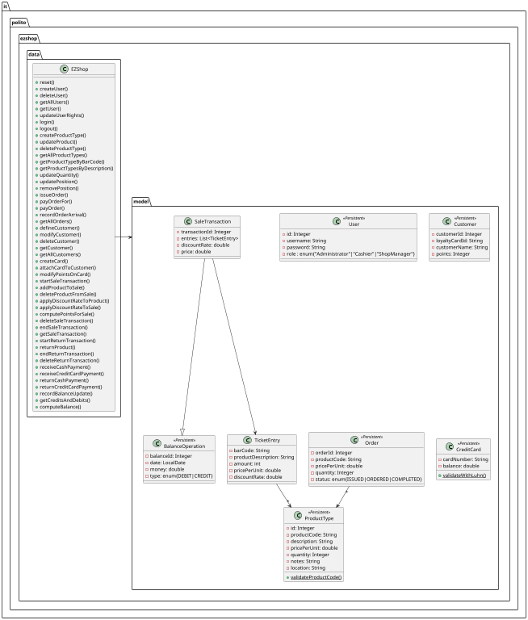

# Verification traceability matrix

| FR  | Customer | ProductType | SaleTransaction | Exception | Order | User | TicketEntry | BalanceOperation | CreditCard | EZShop |
| --- | :------: | :---------: | :-------------: | :-------: | :---: | :--: | :---------: | :--------------: | :--------: | :----: |
| FR1 |          |             |                 |         x |       |    x |             |                  |            |      x | 
| FR3 |          |           x |                 |         x |     x |    x |             |                x |            |      x | 
| FR4 |          |           x |               x |         x |     x |    x |             |                x |            |      x | 
| FR5 |        x |             |                 |         x |       |    x |             |                  |            |      x | 
| FR6 |        x |           x |               x |         x |       |    x |           x |                x |            |      x | 
| FR7 |        x |             |               x |         x |       |    x |             |                x |          x |      x | 
| FR8 |          |             |                 |         x |     x |    x |             |                x |            |      x |


# Verification sequence diagrams

## Use Case 1

### Scenario 1-1

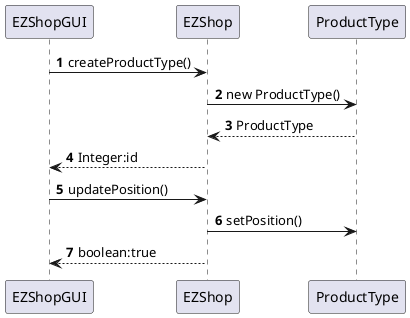

### Scenario 1-3

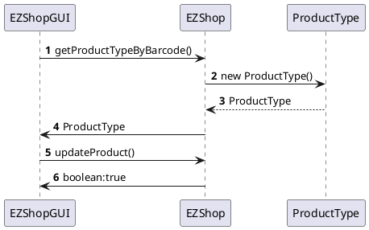

## Use Case 2

### Scenario 2-1

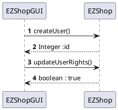

### Scenario 2-2

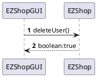

## Use Case 3

### Scenario 3-1

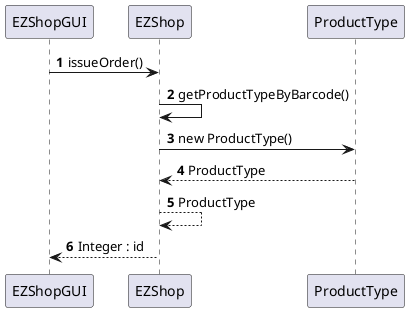

### Scenario 3-2

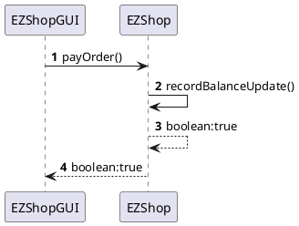

### Scenario 3-3

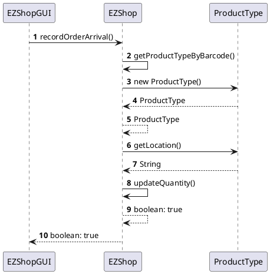

## Use Case 4

### Scenario 4-1 

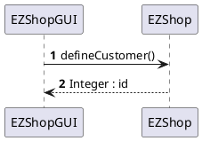

### Scenario 4-2

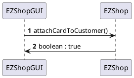

### Scenario 4-4

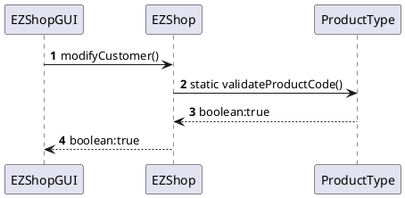

## Use Cases 5

### Scenario 5-1

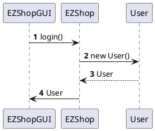

### Scenario 5-2

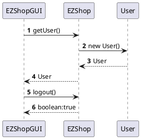

## Use Cases 6

### Scenario 6-1

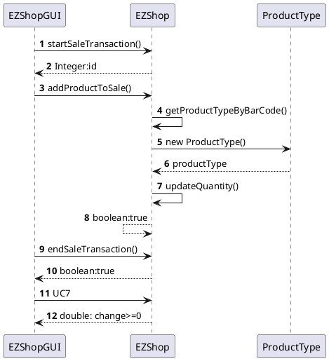

### Scenario 6-2

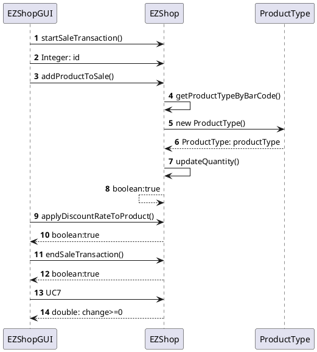

### Scenario 6-4

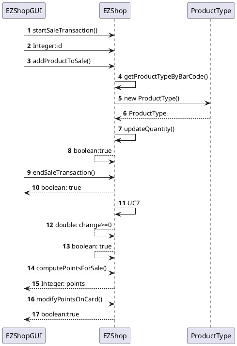

### Scenario 6-5

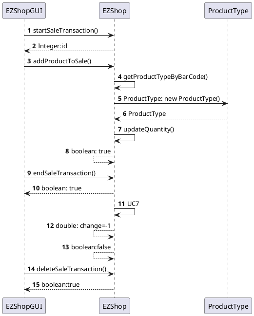

## Use Case 7

### Scenario 7-4

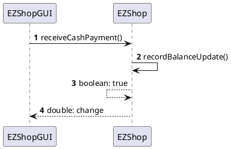

## Use Case 8

### Scenario 8-1

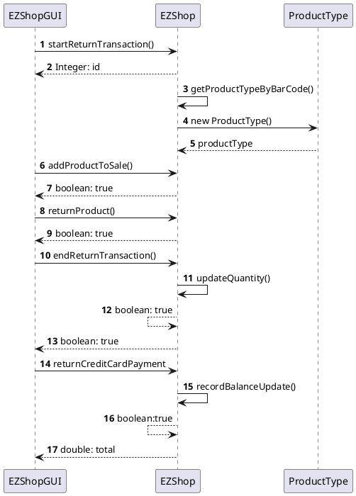

## Use Case 9

### Scenario 9-1

```plantuml
@startuml
autonumber
EZShopGUI -> EZShop : getCreditsAndDebits()
EZShop -> BalanceOperation : new BalanceOperation()
EZShop <-- BalanceOperation : BalanceOperation: balanceOperation
EZShop -> BalanceOperation : new BalanceOperation()
EZShop <-- BalanceOperation : BalanceOperation
EZShop -> BalanceOperation : ...
EZShop <-- BalanceOperation : ...
EZShopGUI <-- EZShop  : ArrayList<BalanceOperation>
@enduml
```

## Use Case 10

### Scenario 10-2

```plantuml
@startuml
autonumber
EZShopGUI -> EZShop : returnCashPayment()
EZShop -> EZShop : recordBalanceUpdate()
EZShop --> EZShop : boolean:true
EZShop --> EZShopGUI : double: return
@enduml
```
