```plantuml
@startgantt
[Analysis of requirements] lasts 1 days
[Requirements document] lasts 2 days
[GUI design] lasts 1 days
[Planning and work assignments] lasts 1 days
[Analysis of system design] lasts 2 days
[Analysis of requirements] -> [GUI design]
[Analysis of requirements] -> [Planning and work assignments]
[Analysis of requirements] -> [Analysis of system design]
[Design document] lasts 2 days
[Planning and work assignments] -> [Design document]
[Brainstorming] lasts 1 days
[Analysis of system design] -> [Brainstorming]
[Coding] lasts 2 days
[Analysis of system design] -> [Coding]
[Database creation] lasts 2 days
[Brainstorming] -> [Database creation]
[Testing and bug fixing] lasts 2 days
[Coding] -> [Testing and bug fixing]
[Validation and Integration] lasts 1 days
[Database creation] -> [Validation and Integration]
[Deployment] lasts 2 days
[Database creation] -> [Deployment]
[End project self-evaluation] lasts 1 days
[Validation and Integration] -> [End project self-evaluation] 
[Risk management] lasts 1 days
[Validation and Integration] -> [Risk management]
@endgantt
```

# Project Estimation

Authors: Roberto Alessi (290180), Michelangelo Bartolomucci (292422), Gianvito Marzo (281761), Roberto Torta (290184)

Date: 29/04/2021

Version: 0.2

# Contents
- [Estimate by product decomposition]
- [Estimate by activity decomposition]

# Estimation approach

<Consider the EZShop project as described in YOUR requirement document, assume that you are going to develop the project INDEPENDENT of the deadlines of the course>

## Estimate by product decomposition

###
|                                                                                                        | Estimate                                 |
| ------------------------------------------------------------------------------------------------------ | ---------------------------------------- |
| NC =  Estimated number of classes to be developed                                                      | 12                                       |
| A = Estimated average size per class, in LOC                                                           | 200 LOC                                  |
| S = Estimated size of project, in LOC (= NC * A)                                                       | 2400 LOC                                 |
| E = Estimated effort, in person hours (here use productivity 10 LOC per person hour)                   | 240 Person Hours                         |
| C = Estimated cost, in euro (here use 1 person hour cost = 30 euro)                                    | 7200 €                                   |
| Estimated calendar time, in calendar weeks (Assume team of 4 people, 8 hours per day, 5 days per week) | 240/(4*8) = 7.5 days = 1weeks + 2.5days  |

## Estimate by activity decomposition

###
|      Activity name                    |  Estimated effort (person hours)  |             
| ------------------------------------- | --------------------------------- | 
| Analysis of requirements              | 12                                |
| Requirements document                 | 36                                |
| GUI design                            | 8                                 |
| Planning and work assignments         | 4                                 |
| Analysis of system design             | 12                                |
| Design document                       | 40                                |
| Brainstorming                         | 2                                 |
| Coding                                | 42                                |
| Database creation                     | 10                                |
| Testing and bug fixing                | 36                                |
| Validation and Integration            | 20                                |
| Deployment                            | 4                                 |
| End project self-evaluation           | 4                                 |
| Risk management                       | 10                                |
| **Total**                             | 240                               |

###

<Insert here Gantt chart with above activities>

