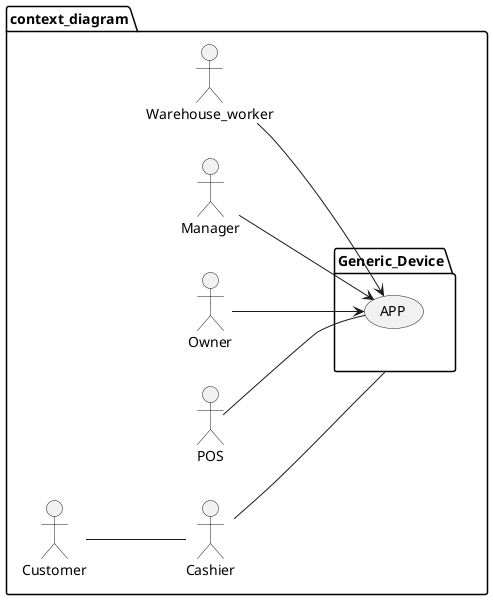
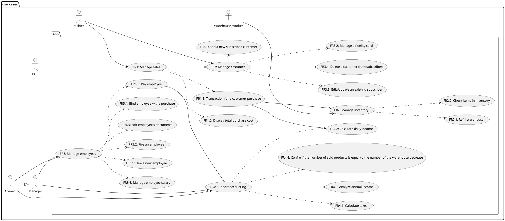

# Requirements Document 

Authors:

Date:

Version:

# Contents

- [Essential description](#essential-description)
- [Stakeholders](#stakeholders)
- [Context Diagram and interfaces](#context-diagram-and-interfaces)
	+ [Context Diagram](#context-diagram)
	+ [Interfaces](#interfaces) 
	
- [Stories and personas](#stories-and-personas)
- [Functional and non functional requirements](#functional-and-non-functional-requirements)
	+ [Functional Requirements](#functional-requirements)
	+ [Non functional requirements](#non-functional-requirements)
- [Use case diagram and use cases](#use-case-diagram-and-use-cases)
	+ [Use case diagram](#use-case-diagram)
	+ [Use cases](#use-cases)
    	+ [Relevant scenarios](#relevant-scenarios)
- [Glossary](#glossary)
- [System design](#system-design)
- [Deployment diagram](#deployment-diagram)

# Essential description

Small shops require a simple application to support the owner or manager. A small shop (ex a food shop) occupies 50-200 square meters, sells 500-2000 different item types, has one or a few cash registers 
EZShop is a software application to:
* manage sales
* manage inventory
* manage customers
* support accounting

# Stakeholders

| Stakeholder name  | Description |
| ----------------- |:-----------:|
|   End user   	    | warehouse workers, cashiers, cash registers, managers, owners |
| Company that develops | software eng, mecha engineers, electrical engineers, marketing people, safety engineers |
| Maintainers | the same company that develops the app |
| Certification authority |  |
| Generic Device |  |
| Suppliers, customers |  |
| Item |  |

# Context Diagram and interfaces

## Context Diagram

## Interfaces

| Actor | Logical Interface | Physical Interface  |
| ------------- |:-------------:| -----:|
| Cashier     | On/off button | GUI |
|             | scan item command | Barcode scanner |
|             | onClick command | Touchscreen |
| Generic Device | 220V 50hz | Cash Register |
| | Pos | Internet connection |
| Warehouse worker | GUI | On/off button |
| | | Touchscreen |
| Manager/Owner | GUI | On/off button |
| | | Touchscreen |

# Stories and personas
\<A Persona is a realistic impersonation of an actor. Define here a few personas and describe in plain text how a persona interacts with the system>

\<Persona is-an-instance-of actor>

\<stories will be formalized later as scenarios in use cases>

# Functional and non functional requirements

## Functional Requirements

| ID        | Description  |
| ------------- |:-------------:|
| FR1 Manage sales |  |
| FR1.1 Transaction for a customer purchase  |   |
| FR1.1.1 Check the register number  | |
| FR1.1.1.1 Electronic transaction | |
| FR1.1.1.1.1 Check for fidelity card | |
| FR1.1.1.1.2 Make the transaction through the POS | |
| FR1.1.1.2 Cash transaction | |
| FR1.1.1.2.1 Check for fidelity card | |
| FR1.2 Display total purchase cost | |
| FR2 Manage inventory | |
| FR2.1 Refill warehouse | |
| FR2.1.1 warehouse receives the supply from the suppliers | |
| FR2.1.2 warehouse increase the items supply level | |
| FR2.2 Check items in inventory | |
| FR2.2.1 Check only by name | |
| FR2.2.2 Check quantity | |
| FR2.2.2.1 Order new supply if the level is below a threshold | |
| FR2.2.2.1.1 Make an order from suppliers | |
| FR2.2.3 Make dispute to the supplier for bad/damaged products | |
| FR3 Manage customers | |
| FR3.1 Add a new subscribed customer | |
| FR3.2 Manage a fidelity card | |
| FR3.2.1 Check fidelity points | |
| FR3.2.2 Give gifts to subscriber after threshold | |
| FR3.3 Edit/Update an existing subscriber | |
| FR3.4 Delete a customer from subscribers | |
| FR4 Support accounting | |
| FR4.1 Calculate taxes | |
| FR4.2 Calculate daily income | |
| FR4.3 Analyze annual income | |
| FR4.4.1 Analyze and display total income | |
| FR4.4.2 Analyze and display net income | |
| FR4.4 Check numbers of sold products if equal to inventory warehouse decrement | |
| FR5 Manage employees | |
| FR5.1 Hire a new Employee | |
| FR5.2 Fire an Employee | |
| FR5.3 Edit employee’s documents | |
| FR5.4 Bind employee with a purchase (for statistic’s sake) | |
| FR5.5 Pay employee | |
| FR5.6 Manage employee salary | |
| FR | |
| FR | |
| FR | |
| FR | |
| FR | |

## Non Functional Requirements

| ID        | Type (efficiency, reliability, ..)           | Description  | Refers to |
| ------------- |:-------------:| :-----:| -----:|
| NFR1 | size | manage a maximum of 2500 item types | |
| NFR2 | size | manage a maximum of 50 employees | |
| NFR3 | efficiency | be able to complete actions in less than 2 clicks | |
| NFR4 | portability | deployable on different operating systems (Java) | |
| NFR5 | speed | low latency (1 seconds for action) | |
| NFR6 | ease of use | time to learn how to use for non engineer < 15minutes | |
| NFR7 | efficiency | response time to any (virtual) button pressed <1sec | |
| NFR8 | robustness | availability at least 99% | |
| NFR9 | | | |
| NFR10 | | | |
| NFR | | | |
| NFR | | | |
| NFR | | | |
| NFR | | | |
| NFR | | | |

# Use case diagram and use cases

## Use case diagram

### Use case 1, UC1
| Actors Involved         |Cashier, Customer, POS, Barcode Scanner  |
| ------------- |:-------------:|
|  Precondition     | Cash register is ON |
| | Barcode scanner is ready |
| | Item’s barcode is valid |
| | POS is connected |
|  Post condition     | / |
|  Nominal Scenario     | Items scan,transaction is okay, print receipt, update inventory |
|  Variants     |1.2, 1.3|

##### Scenario 1.1 

| Scenario 1.1 | |
| ------------- |:-------------:|
|  Precondition     | Cash register is ON |
| | Barcode scanner is ready |
| | Item’s barcode is valid |
| | POS is connected |
|  Post condition     | / |
| Step#        | Description  |
|  1     |The cashier scans the items |
|  2     |The cashier scans the fidelity card (optional) |
|  3     |The display shows the price of the transaction |
|  4     |The transaction is made (cash or POS) |
|  5     |After confirm, print receipt |
|  6     |Update warehouse inventory |

##### Scenario 1.2
| Scenario 1.2 | |
| ------------- |:-------------:|
|  Precondition     | Cash register is ON |
| | Barcode scanner is ready |
| | Item’s barcode is valid |
| | POS is not connected |
|  Post condition     | Cash is available, want to retry transaction |
| Step#        | Description  |
|  1     | The cashier scans the items |
|  2     | The cashier scans the fidelity card (optional) |
|  3     | The display shows the price of the transaction |
|  4     | The transaction is made with POS |
|  5     | Transaction fails |
|  ...     |  |
|  ...     |  |
|  ...     |  |
|  ...     |  |
|  ...     |  |

##### Scenario 1.3
| Scenario 1.3 | |
| ------------- |:-------------:|
|  Precondition     | Cash register is ON |
| | Barcode scanner is ready |
| | Item’s barcode isn't valid |
| | POS is connected |
|  Post condition     | Items returned to warehouse |
| Step#        | Description  |
|  1     | The cashier scans the items |
|  2     | Item is not recognized (barcode not valid) |
|  3     | Ignore item and keep scanning |
|  4     | The cashier scans the  fidelity card (optional) |
|  5     | The display shows the price of the transaction |
|  6     | The transaction is made with cash |
|  7     | Print receipt |
|  8     | Update warehouse inventory |

### Use case 2, UC2
| Actors Involved | Manager, Owner, Warehouse workers  |
| ------------- |:-------------:|
|  Precondition           | /                 |
|  Post condition         | Items are guaranteed |
|  Nominal Scenario       | Item search, item found, item quantity printed and is over threshold   |
|  Variants             |1.2, 1.3             |

#### Scenario 2.1
| Scenario 2.1 | |
| ------------- |:-------------:|
|  Precondition     |  |
|  Post condition     | There is no need to order the item |
| Step#        | Description  |
|  1     | The actor involved search for the item |
|  2     | The item is found |
|  3     | Item quantity is printed and is enough |

##### Scenario 2.2
| Scenario 2.2 | |
| ------------- |:-------------:|
|  Precondition     | / |
|  Post condition     | The cost for the order is registered in the accounting |
| Step#        | Description  |
|  1     | The actors involved search for the item |
|  2     | The item is found |
|  3     | Item quantity is printed but it’s lower than the threshold |
|  4     | An order to the supplier is made |

### Use case x, UCx
..

# Glossary

\<use UML class diagram to define important terms, or concepts in the domain of the system, and their relationships> 

\<concepts are used consistently all over the document, ex in use cases, requirements etc>

# System Design
\<describe here system design>

\<must be consistent with Context diagram>

# Deployment Diagram

\<describe here deployment diagram >

